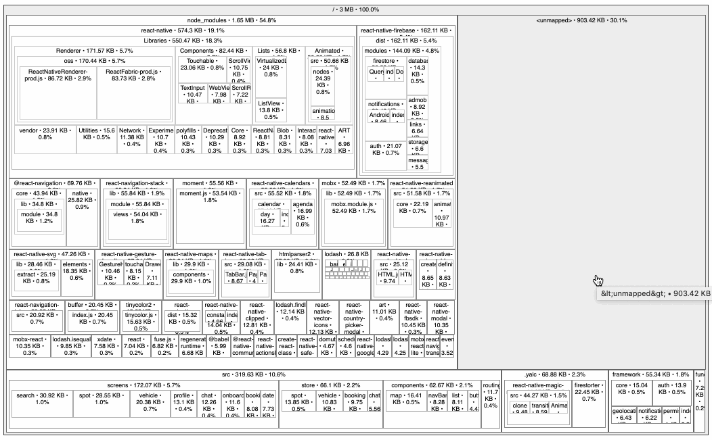

# LOOKING FOR NEW MAINTAINER / HOME

This repository is looking for a new maintainer and home. 🏠
Please contact me [here](mailto:hrutjes@gmail,com) when you are interested in continuing development or know a new place.
This repository will be archived automatically in Q1 of 2022.

# react-native-bundle-visualizer

See what's inside of your react-native bundle 📦



Uses the awesome [source-map-explorer](https://github.com/danvk/source-map-explorer) to visualize the output of the [Metro bundler](https://github.com/facebook/metro).

## Purpose

Sometimes, importing a single javascript library can drastically increase your bundle size. This package helps you to identify such a library, so you can keep the bundle size low and loading times fast.

## Usage

Make sure [npx](https://github.com/npm/npx) is installed and run the following command in your project root

`npx react-native-bundle-visualizer`

### Or install as a dev-dependency

```sh
yarn add --dev react-native-bundle-visualizer
```

And run it:

```
yarn run react-native-bundle-visualizer
```

_or when using npm:_

```
npm install --save-dev react-native-bundle-visualizer ./node_modules/.bin/react-native-bundle-visualizer
```

## Command line arguments

All command-line arguments are optional. By default a production build will be created for the `ios` platform.

| Option          | Description                                                                                                                                                  | Example                          |
| --------------- | ------------------------------------------------------------------------------------------------------------------------------------------------------------ | -------------------------------- |
| `platform`      | Platform to build (default is **ios**)                                                                                                                       | `--platform ios`                 |
| `dev`           | Dev or production build (default is **false**)                                                                                                               | `--dev false`                    |
| `entry-file`    | Entry-file (when omitted tries to auto-resolve it)                                                                                                           | `--entry-file ./index.ios.js`    |
| `bundle-output` | Output bundle-file (default is **tmp**)                                                                                                                      | `--bundle-output ./myapp.bundle` |
| `format`        | Output format **html**, **json** or **tsv** (default is **html**) (see [source-map-explorer options][smeo])                                                  | `--format json`                  |
| `only-mapped`   | Exclude "unmapped" bytes from the output (default is **false**). This will result in total counts less than the file size.                                   | `--only-mapped`                  |
| `verbose`       | Dumps additional output to the console (default is **false**)                                                                                                | `--verbose`                      |
| `reset-cache`   | Removes cached react-native files (default is **false**)                                                                                                     | `--reset-cache`                  |

[smeo]: https://github.com/danvk/source-map-explorer#options

> The `--expo` command is no longer needed for Expo SDK 41 or higher; and has been removed. Use [react-native-bundle-visualizer@2](https://github.com/IjzerenHein/react-native-bundle-visualizer/tree/v2) when targetting Expo SDK 40 or lower.

## Version compatibility

| Version                                                                       | Comments                                                                                                                                                              |
| ----------------------------------------------------------------------------- | --------------------------------------------------------------------------------------------------------------------------------------------------------------------- |
| 3.x                                                                           | Compatible with React-Native CLI bootstrapped projects and Expo SDK 41 or higher. | 
| [2.x](https://github.com/IjzerenHein/react-native-bundle-visualizer/tree/v2) | Compatible with React-Native CLI bootstrapped projects and Expo SDK 40 or earlier.                                                                                                           |
| [1.x](https://github.com/IjzerenHein/react-native-bundle-visualizer/tree/v1) | Uses the [Haul bundler](https://github.com/callstack/haul) instead instead of the Metro output. | 

## License

[MIT](./LICENSE.txt)
