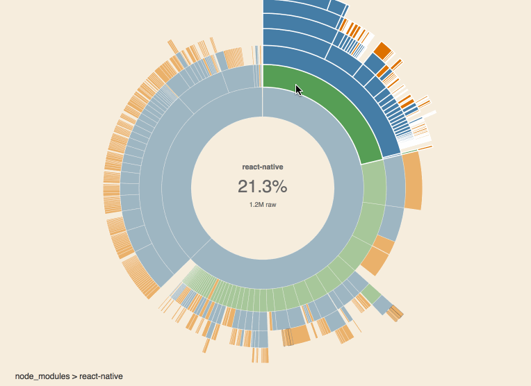

# react-native-bundle-visualizer

See what's inside of your react-native bundle 📦



Uses the awesome [webpack-visualizer](https://github.com/chrisbateman/webpack-visualizer) and [haul](https://github.com/callstack-io/haul) bundler.

## Purpose

Sometimes, importing a single javascript library can drastically increase your bundle size. This package helps you to identify such a library, so you can keep the bundle size low and loading times fast.

## Usage

**Make sure you have node 8 or higher installed.**

Install as a dev dependency:

	yarn add --dev react-native-bundle-visualizer
	
And run it:

	yarn run react-native-bundle-visualizer

*or when using npm:*

	npm install --save-dev react-native-bundle-visualizer
	./node_modules/.bin/react-native-bundle-visualizer

*requires node 8 or higher*

### Gitignore output files

Additionally, add the haul generated `dist` and `.happypack` folders to your `.gitignore` file:

```
dist/
.happypack/
```

## Disclaimer

The sizes reported are an indication rather than the exact byte size in your bundle. This is because the Haul packager returns different bundles compared to the react-native Metro bundler. Also, due to limitations in webpack's stats, the "actual" (minified) numbers reported here are approximate, but they should be pretty close.

## License

[MIT](./LICENSE.txt)

